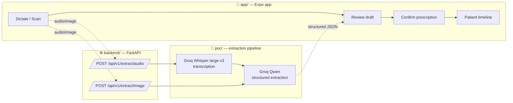
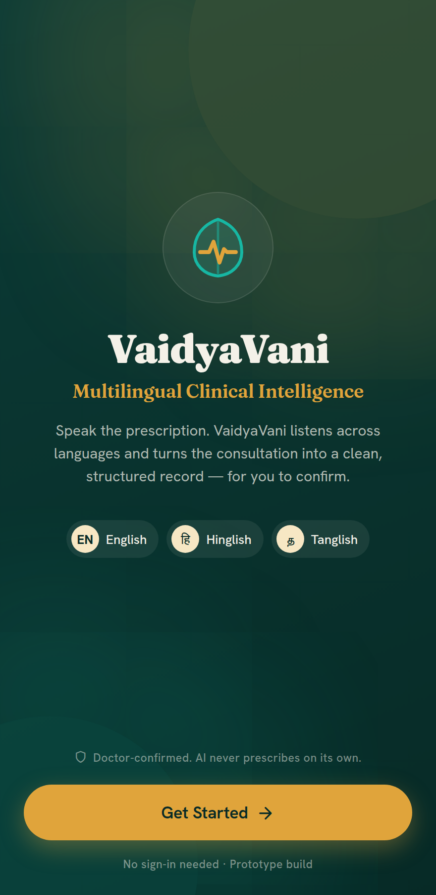
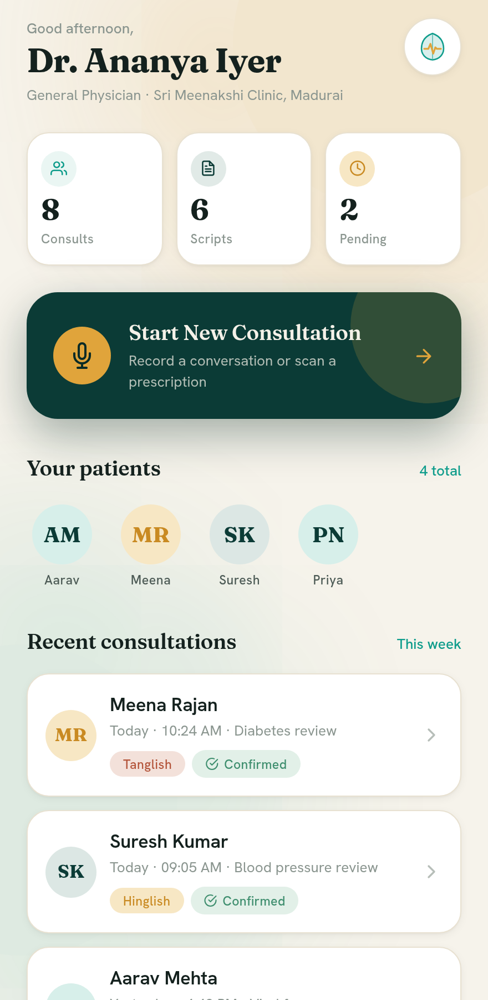
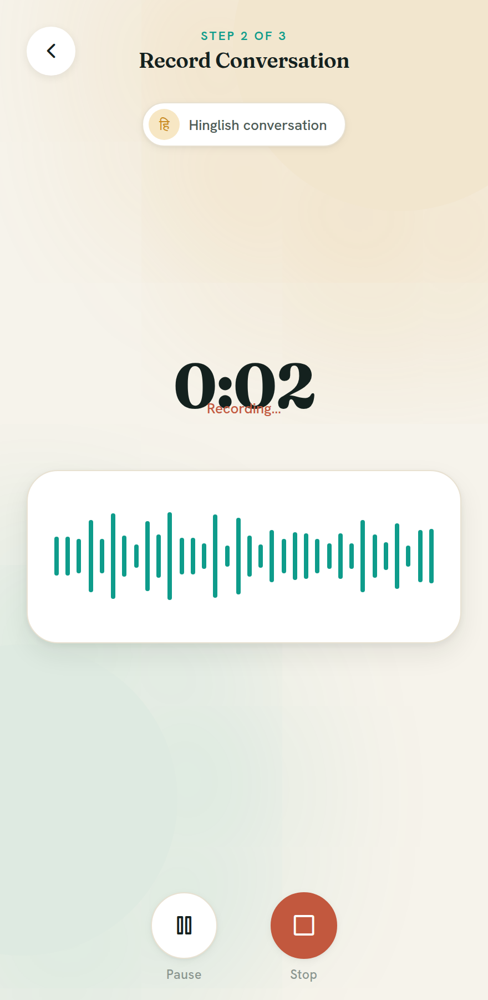
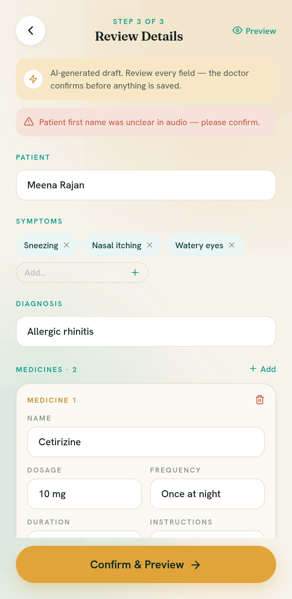
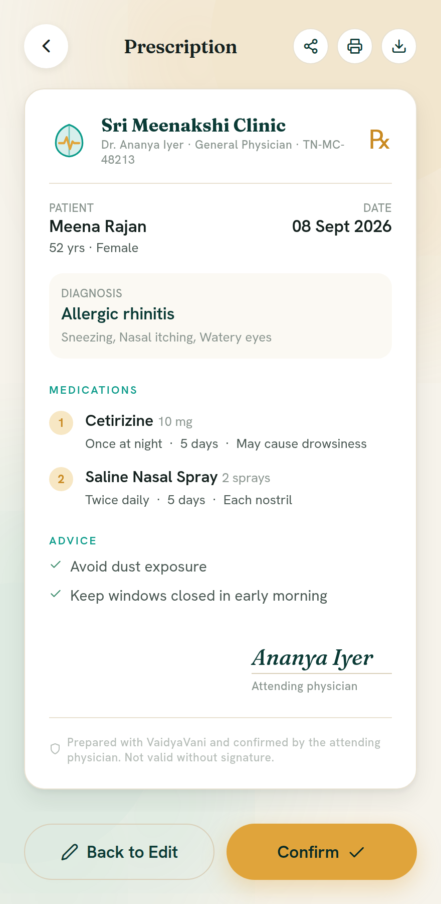

# VaidyaVani

> A phone-first clinical assistant that turns a doctor's spoken prescription and a
> patient's paper records into one structured, shareable health profile — built for
> India's tier-2/3 hospitals, across English, Hinglish, and Tanglish.

<p align="center">
  
  
  
  
</p>

---

## The problem

Most Indian hospitals outside the big metro chains still run on paper prescriptions and
disconnected records. A patient's history is scattered across three clinics and a folder,
not one app. Doctors lose consult time writing by hand, pharmacies work from illegible
orders, and the next doctor has no summary to start from. Existing ambient-scribe tools
(Suki, Nuance DAX, Abridge) start around **$200–$600+ per provider per month**, assume
**English-only** dictation, and are built for US hospitals on Epic/Cerner.

## What VaidyaVani does

1. **Dictate** — the doctor speaks the prescription into the phone (medicine, dose,
   frequency, duration), in English, Hinglish, or Tanglish.
2. **Scan** — staff photograph existing paper prescriptions and lab reports to backfill history.
3. **Structure** — both feed one patient record: a visit timeline, current medications, and
   basic insurance info.
4. **Confirm** — every generated record is an editable **AI draft**; the doctor reviews and
   confirms before anything is saved. The AI never prescribes on its own.
5. **Sync** — the confirmed record syncs to a front-desk / pharmacy dashboard.

## Repository layout

This is a monorepo with four independent, self-documented packages:

| Path | What it is | Stack | Docs |
|------|------------|-------|------|
| [`app/`](app/) | Phone-first mobile app — the full doctor journey (9 screens) | React Native · Expo (web + native) | [app/README.md](app/README.md) |
| [`backend/`](backend/) | REST API exposing the extraction pipeline to the app | FastAPI · Python | [backend/README.md](backend/README.md) |
| [`poc/`](poc/) | Standalone proof-of-concept extraction script + evaluation | Python · Groq | [poc/README.md](poc/README.md) |
| [`docs/`](docs/) | Pitch deck, walkthrough video, and submission material | — | [docs/README.md](docs/README.md) |

## Architecture



The app talks to the backend **only** through a small service layer
([`app/src/services/consultationService.js`](app/src/services/consultationService.js)), which
today returns mock promises. Screens depend on that layer alone, so going live means
implementing it against the API and mapping the response into the app's data model — no
screen changes required. The two layers use **different shapes today** (see
[Data shapes](#data-shapes)); a small adapter bridges them.

## Quick start

Each package runs independently. Pick what you need:

### Mobile app (`app/`)

```bash
cd app
npm install
npm run web          # opens the app in a browser; or `npm start` for Expo Go on a device
```

Runs entirely on mock data — no backend or API key required. See [app/README.md](app/README.md).

### Backend API (`backend/`)

Run these **from the repository root** (the API imports the pipeline from `poc/`). The
requirements pull in `poc/`'s dependencies, so one virtualenv covers both.

```bash
python -m venv backend/.venv
backend/.venv/bin/python -m pip install -r backend/requirements.txt
cp backend/.env.example backend/.env         # add your Groq API key
backend/.venv/bin/python -m uvicorn backend.main:app --reload --port 8000 --env-file backend/.env
```

Interactive API docs at `http://localhost:8000/docs`. Endpoints: `GET /health`,
`POST /api/v1/extract/audio`, `POST /api/v1/extract/image`. See
[backend/README.md](backend/README.md).

### Extraction POC (`poc/`)

```bash
cd poc
python -m venv .venv && . .venv/bin/activate
pip install -r requirements.txt
cp .env.example .env                          # add your Groq API key
python extract.py samples/audio_01.mp4 --output examples/audio_01.json
```

See [poc/README.md](poc/README.md) and [poc/EVALUATION.md](poc/EVALUATION.md).

## Data shapes

The app and the backend use **two different shapes today**, and a small adapter maps the
backend response into the app's model during integration. They are documented here so that
mapping is unambiguous.

**App model** — what the screens and the mock service
([`consultationService.js`](app/src/services/consultationService.js)) consume:

```jsonc
{
  "patient":  { "id": "pat-002", "name": "Meena Rajan", "age": 52, "gender": "Female" },
  "source":   { "type": "audio", "language": "hinglish", "transcript": "…" },
  "clinical": {
    "symptoms":  ["Sneezing", "Nasal itching"],
    "diagnosis": "Allergic rhinitis",
    "medicines": [
      { "name": "Cetirizine", "dosage": "10 mg", "frequency": "Once at night",
        "duration": "5 days", "instructions": "May cause drowsiness" }
    ],
    "advice":    ["Avoid dust exposure"],
    "notes":     "Seasonal allergic rhinitis."
  },
  "warnings": ["Patient first name was unclear in audio — please confirm."],
  "status":   "needs_review"
}
```

`language` is one of `english` · `hinglish` · `tanglish`. `status` moves from
`needs_review` to `confirmed` only after the doctor confirms.

**Backend response** — what `POST /api/v1/extract/{audio,image}` actually returns today
(see [`backend/main.py`](backend/main.py)):

```jsonc
{
  "source_file": "audio_01.mp4",
  "source_type": "audio",
  "transcript":  "…",
  "prescription": {
    "patient_name": "Meena Rajan",
    "medicines": [
      { "name": "Cetirizine", "dosage": "10 mg", "frequency": "Once at night",
        "duration": "5 days", "instructions": "May cause drowsiness" }
    ],
    "notes":      "…",
    "confidence": "medium"
  },
  "requires_review": true
}
```

**Mapping notes for integration:** `prescription.patient_name` → `patient.name`,
`prescription.medicines` → `clinical.medicines`, `prescription.notes` → `clinical.notes`,
and `confidence` / `requires_review` drive `warnings` and `status`. The app UI also has
`clinical.symptoms`, `clinical.diagnosis`, and `clinical.advice`, which the extraction
backend does **not** produce yet — the adapter should default these (e.g. empty) until the
pipeline emits them.

## The app, screen by screen

<p align="center">
  
  
  
  
  
</p>

Welcome → Dashboard → New Consultation → Audio Recording / Image Upload → Processing →
Review → Prescription Preview → Patient Timeline. Full gallery and design notes in
[app/README.md](app/README.md).

## Safety & scope

VaidyaVani is a **prototype**. It is not a medical device and must not be used for real
patient care. Every extracted record is an editable draft requiring clinician confirmation;
the system never authorises a prescription on its own. Use invented demo patients only —
never upload a real patient's data.

## Roadmap

- [x] Multilingual voice + image extraction proof of concept ([`poc/`](poc/))
- [x] Full nine-screen mobile app on mock data ([`app/`](app/))
- [x] FastAPI service wrapping the extraction pipeline ([`backend/`](backend/))
- [ ] Wire the app's service layer to the live backend
- [ ] On-device STT for common drug vocabulary
- [ ] Real front-desk / pharmacy dashboard sync

## Team

Built for the iQOO Reskill Hackathon by **Team DROS** — Srinath Balakrishnan, Pranesh S,
and Umasuthan.
